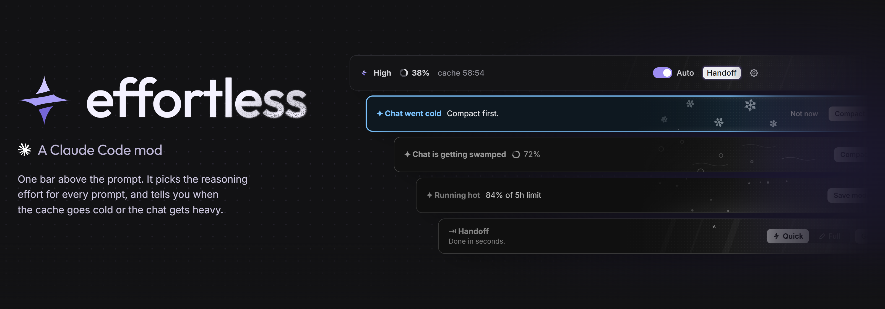
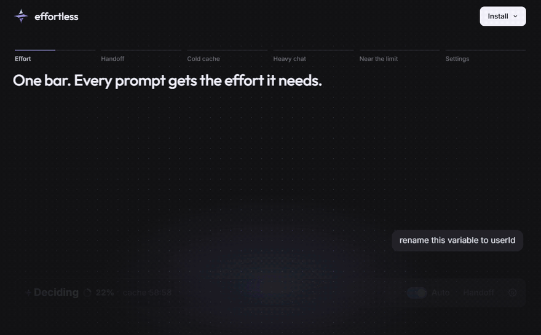
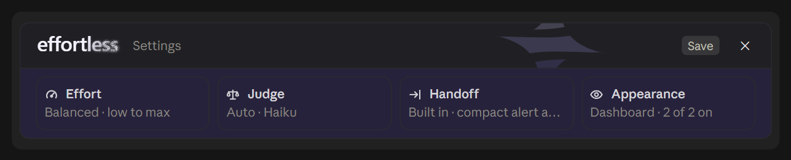

<p align="center">
  
</p>

<p align="center">
  <a href="https://heycubit.github.io/effortless/"><b>Website</b></a> ·
  <a href="#install"><b>Install</b></a> ·
  <a href="#what-the-bar-shows"><b>What it shows</b></a> ·
  <a href="#pick-your-judge"><b>Judges</b></a>
</p>

https://github.com/user-attachments/assets/9b5af48e-2ad8-4826-9443-4aeea1306664

A Claude Code mod that picks the model and the reasoning effort for every prompt. Easy questions run on **Haiku** or
**Sonnet** at a low effort; hard jobs get **High** on your own model, and you never touch the model or Effort control.
In one long chat on Opus about half the replies ran on Sonnet or Haiku, roughly half the cost by our estimate. One bar above the prompt also shows how full the chat is, how long
the prompt cache stays warm, and hands off or compacts in one click when a chat gets heavy.

<p align="center">
  
</p>

## Powered by Haiku 5.5

Haiku 5.5 costs about 75% less than Haiku 4.5, and Anthropic names compaction and quick, well-defined work among what
it is built for. effortless uses it in three places:

| | |
|---|---|
| **The judge** | reads each prompt and picks the effort and model, in about a second, on your own Claude login |
| **Cheaper model when it can** | a prompt the judge calls simple runs on Haiku 5.5 (or Sonnet), never above your chat's model. Only that prompt moves: your chat stays on its model, and that model's cache stays warm for the next hard prompt. The bar shows the model beside the effort: `Low · Haiku`, `High · Opus` |
| **Compaction** | every compaction, `/compact` and the automatic one included, is summarized by Haiku 5.5. If Haiku fails, Claude Code compacts as usual |

Each can be switched off: Settings → Judge → Model, and Settings → Handoff → Compact with.

## Install

Two ways. Both take a minute and need no terminal.

**1. Ask Claude** (easiest). Paste this into Claude Code and press Enter:

```text
Install the effortless plugin for me: run `claude plugin marketplace add HeyCubit/effortless` and then `claude plugin install effortless@effortless`. When both succeed, tell me to run /reload-plugins.
```

**2. Commands.** Type these two lines in Claude Code's chat box:

```text
/plugin marketplace add HeyCubit/effortless
```

```text
/plugin install effortless@effortless
```

Or in a terminal, in one line:

```bash
claude plugin marketplace add HeyCubit/effortless; claude plugin install effortless@effortless
```

Then run `/reload-plugins` (or restart Claude Code). A short setup opens above the prompt: keep **Haiku** alone (one click,
no key, runs on your own Claude login) or add **Jev** (a TypeSafe key, about 4x faster effort calls), lean cheaper or
smarter, and pick how handoffs are written. Run `/effortless setup` to go through it again, or change any of it in ⚙.

Updates come to you: when a new version is out, a card above the prompt offers **Update** or **Later**. Update loads the
new version in the chat you pressed it in, with nothing to type.

## What the bar shows

<p align="center"></p>

| On the bar | Means |
|---|---|
| **High · Opus** | the effort and the model Auto picked for this prompt. `Deciding` while the judge thinks; a switch flashes violet and fades to white. A cheaper model after it (`Low · Haiku`) means only this prompt runs there |
| **◔ 38%** | how full the chat's context is |
| **cache 59:00** | time until the prompt cache goes cold, after which the next message pays full price to re-read the chat |
| *Haiku: a refactor…* | who judged and why |
| **Auto** | switches the judge on and off. Changing effort in the app yourself also turns Auto off: you always win |
| **Compact** | compacts the chat. It turns into a glowing **Handoff** when Haiku says a fresh chat would pay off, with Compact as quiet text beside it. Set Settings → Handoff → Handoff button to **Always** to keep Handoff on the bar |
| **⚙** | settings |

Prefer it quiet? Settings → Customize has a **Minimal** look with no bar.

### When a chat gets heavy

When the cache has gone cold on a big chat, the bar turns to ice with **Compact** and **Handoff**:

<p align="center"></p>

**Handoff** writes a summary of the chat and carries on in a clean one. **Quick** takes a few seconds; **Full** checks
git and saves `HANDOFF.md` (or runs your own skill). Then clear and carry on, clear and wait, or keep the chat and copy.

<p align="center"></p>

**Compact** takes an optional note for what the summary should keep. Every compaction, also `/compact` and the automatic one, is written by **Haiku 5.5** by default, which Anthropic recommends for compaction at a fraction of the chat model's price; if Haiku fails, Claude Code compacts as usual. Switch it in Settings → Handoff → Compact with.

<p align="center"></p>

The bar also warns when a chat is getting swamped (each message re-reads a lot of context), when a 5-hour or weekly
limit passes 80% (with a Save mode that caps effort at Medium), and when your judge stops answering.

### Settings

<p align="center"></p>

## Haiku, and Jev if you add it

Haiku 5.5 runs on your own Claude login and needs no key. It always makes the handoff call: from 30% of context, every second message, it reads what the chat was for, the trail of topics, the last reply and how full the context is, and says a fresh chat would suit only for a clear reason. Then the Compact button turns into a lit Handoff with the reason. Want Handoff on the bar all the time? Settings → Handoff → Handoff button → **Always**.

Haiku also picks the effort, unless you add Jev, TypeSafe's faster judge (about 0.25 s against about 1 s). With a key, Jev answers the effort first and Haiku steps in whenever Jev is unsure. Run `/plugin configure effortless@effortless` in Claude Code, or use the setup guide or the Judge card in Settings.

| Setting | What it does |
|---|---|
| `auto` (default) | Haiku, and Jev too when a [TypeSafe](https://typesafe.ai) key is set in the settings or `TYPESAFE_API_KEY` |
| `haiku` | Haiku only, a key is never used |
| `jev` | Haiku and Jev, and the key may also come from `~/.config/jev/.env` |

A key set with `/plugin configure` is kept in Claude Code's secure storage. A key pasted in the setup guide or the Judge card is written in plain text to `~/.config/jev/.env` (the file the jev skills read), never to a file of this repo. If Jev fails or takes longer than 3 seconds, Haiku judges that prompt and effortless tells you why once per session (out of credits, key rejected, no answer).

Short follow-ups such as "go", "ok" or "yes" keep the effort already picked and ask no judge.

## Keys and trust

- The default judge needs **no key**: Haiku runs on your own Claude login.
- A key is only needed to add Jev. Enter it with `/plugin configure`, never on the command line, so it stays out of your shell history: Claude Code then keeps it in its secure storage. A key pasted in the setup guide or the Judge card is saved in plain text to `~/.config/jev/.env` instead, so prefer `/plugin configure` on a shared machine.
- A key is sent only to TypeSafe, and to nothing else. Use a key with a spending limit if your provider offers one.
- Like any Claude Code plugin, this mod runs code on your machine. Its code is in [`hooks/`](hooks/): read it before you install if you do not know the author. The programs it starts are `claude` itself (to update or uninstall the mod when you press those buttons), `git` (to see if a new version is out) and, on Update, a plain file copy of the new version into the folder your open chat runs from.

## What it saves, honestly

Measured over 80k requests of real Claude Code use, about 76% of the cost is the context being read back from the cache on every tool call, 16% cache writes and only 8% output. Effort mostly changes how many tool calls a prompt makes.

- Against a high default (high, xhigh) Auto saves a lot: a median xhigh prompt cost about three times a medium one.
- Against a medium default it mostly saves a few percent, and gives hard jobs high on their own.
- Keeping chats short and compacting before the cache goes cold often saves more than effort does. That is what the countdown is for.

## Does the cheaper answer hold up?

`node bench/quality.mjs` answers 30 prompts on Opus and on the model a router would pick, then a blind grader compares them. On 2026-10-09 the cheaper answer was good enough in 28 of 30 (it missed on two Haiku answers), and cost 66 to 78% less on the prompts that moved down. It was almost never better, often slightly worse. One run, one grader, small set: [the full table and its limits](bench/RESULTS.md).

## How often the judge is right

`/effortless bench` runs labelled prompts through each judge you have set up, using the same code a real prompt goes
through, and scores them against a fixed effort. Each case lists the efforts a careful person would accept for that
message on that model. The cases are in [`bench/judge-cases.json`](bench/judge-cases.json); run it yourself.

Two runs on version 1.5.1, 73 cases, Sonnet and Opus 5.5:

| Judge | Right, all 73 | Right, 20 held out | Too low | Too high | Median time |
| --- | --- | --- | --- | --- | --- |
| Always medium | 44% | 40% | 17 | 24 | - |
| Always high | 51% | 50% | 0 | 36 | - |
| Haiku | 92-93% | 95% | 1 | 4-5 | 0.75 s |
| Jev | 99% | 100% | 0 | 1 | 0.24 s |

What this does and does not show:

- It measures whether the judge picks a sensible effort, not how much a session costs or how good the answers are.
- 73 cases is a small set, and the judges are not fully deterministic: runs differ by a few points.
- The judge prompts were tuned on 53 of the cases. The 20 held-out cases were never tuned against, so that column is
  the honest one. They were written after the first run showed which kinds of message miss, so they are not blind.
- Haiku's remaining misses are mostly "yes" or "thanks" after hard work, where it keeps the effort high.

## Models

Effort only changes on Opus 5.5 and Sonnet 5.5. On Fable 5.1 and older models a change of effort between requests rewrote most of the prompt cache, which costs more than it saves, so Auto pauses there and the footer says `Paused`. Haiku takes no effort setting.

## Split view

In the desktop app's split view, Claude Code draws plugin bars only in the left pane. The right pane still draws
replies, so when a chat went cold, is getting swamped or runs hot, a small card in the bar's colours hangs under the
newest reply, naming the command that does what the bar's button would: `/compact`, `/effortless handoff` or
`/effortless save`.

## In the terminal

effortless draws in the terminal CLI too, with moving pixel art in its bands. Claude Code may not load a plugin's code
there yet: if `/effortless` says the mod is not loaded after a restart, add this to `~/.claude/settings.json` and
restart:

```json
{ "env": { "CLAUDE_CODE_ENABLE_FUNCTION_HOOKS": "1" } }
```

Tested on Claude Code 2.1.285 (stable), 2.1.286 and 2.1.288 at 80 and 120 columns. Below 90 columns the bands leave their art out.

## Commands

| Command | Does |
|---|---|
| `/effortless settings` | opens the settings panel |
| `/effortless setup` | runs the setup again |
| `/effortless auto` | Auto on or off |
| `/effortless handoff` / `handoff full` | hands off without the bar, with your last choice of what follows |
| `/effortless stats` | what the prompts Auto steered cost this session, per effort, and what the judge took |
| `/effortless cold`, `swamp`, `hot`, `down` | shows that bar now, to try it |
| `/effortless bench` | scores each judge you have on the labelled prompts in [`bench/judge-cases.json`](bench/judge-cases.json) |
| `/effortless update` | checks for a new version now |

## Open source

effortless is MIT licensed. Like any Claude Code plugin it runs code on your machine, so the whole mod is here to read:
[`hooks/`](hooks/). It sends nothing anywhere except your prompt to the judge you picked.

## Develop

```bash
claude plugin validate .
claude plugin test .
claude --plugin-dir .
```

`tools/render-band` draws the bar the way the desktop app does, without opening it; the images in this README come from it.

## License

[MIT](LICENSE)
